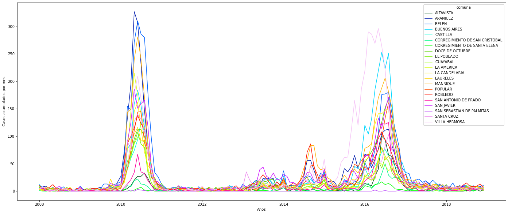

___

# GUÍA METODOLÓGICA DE ACÁMICA
___
## Proyecto 03 Aplicaciones actuales
## Resumen del proyecto
¡Aplica Procesamiento del Lenguaje Natural, Sistemas de Recomendación y **Series de Tiempo** para resolver problemas de relevancia contemporánea!

La realización y entrega del Proyecto es individual.

## Entregables
Un Notebook de Jupyter con la resolución de la consigna. El Notebook debe poder ejecutarse sin errores. En el notebook debe estar el link al repositorio (por ejemplo, de GitHub) donde se pueda encontrar el proyecto entregado.

## Referencias
Apóyate en las bitácoras, los notebooks trabajados y las presentaciones vistas en clase para resolver tu proyecto. También será de mucha utilidad la documentación de las librerías de Python. No dudes en consultar comunidades online como Stack Overflow y, por supuesto, buscar en la web (googlear).

## Consigna

Elige una de las tres opciones de aplicación para elaborar tu proyecto. El objetivo es que apliques las herramientas aprendidas en el dominio que hayas seleccionado. Verás que para cualquiera de las opciones, el trabajo se organiza en tres partes:

* **Parte A** - *Exploración de Datos*: Todo proyecto de Ciencia de Datos empieza con un Análisis Exploratorio de Datos. Y todo Análisis Exploratorio de Datos debe responder preguntas.
* **Parte B** - *Modelo de Machine Learning*: En esta sección deberás aplicar las técnicas de Machine Learning aprendidas para crear un modelo predictivo a partir del dataset provisto.
* **Parte C** - *Investigación*: Las preguntas y cosas para probar nunca se agotan. El objetivo de esta sección es que sugieras cómo continuarías el proyecto, con el fin de mejorar el modelo o responder una pregunta que consideres interesante. En todos los notebooks dejamos algunas sugerencias, pero puedes proponer otras.

## Checklist de evaluación

Sugerencias para desarrollar el proyecto:

La resolución del proyecto te puede enfrentar a desafíos que no trabajamos durante los encuentros. Es importante que desarrolles la capacidad de resolverlos. Para ello, consulta las bitácoras, las referencias, los notebooks vistos en clase, la documentación de la librería y, sobre todo, googlea.

* Los pasos deben estar correctamente justificados.
* Las preguntas que se respondan deben estar correctamente explicitadas.
* Imagina que este proyecto lo usarías para presentar en una entrevista de trabajo, o que lo debes presentar en tu trabajo. Presta mucha atención a la redacción, presentación de gráficos, etc.

Antes de subir tu proyecto a la plataforma Acámica para que sea evaluado, verifica que el Notebook se ejecute sin errores. Además, asegúrate de cumplir con las siguientes condiciones (son las que los/as evaluadores/as tendrán en consideración al momento de corregir tu trabajo):

**Parte A - Exploración de Datos**

* El Análisis Exploratorio de Datos debe servir para comprender el dataset y todo el flujo de trabajo que le siga.
* Debes responder al menos una pregunta original con este dataset. La pregunta debe estar correctamente explicitada.

**Parte B - Modelo de Machine Learning**

* Debes evaluar correctamente el modelo que realices. Esto implica un correcto manejo de datos de Train y Test, elegir una métrica apropiada y justificar su elección, y comparar los resultados contra un modelo benchmark.
* Puedes aplicar más de una de las técnicas vistas para crear tus modelos. Pero ten en cuenta que es preferible un modelo bien hecho (apropiada transformación de datos, optimización de hiperparámetros y análisis de sus resultados) que muchos modelos a medias. En caso de entrenar más de un modelo, debes comparar sus resultados y justificar cuál elegirías.
* Si el modelo lo permite, debes explorar qué información utiliza para predecir e interpretar ese resultado. ¿Coincide con lo que esperabas a partir de tu experiencia con el dataset?

**Parte C - Investigación**

* Debes explicar qué te gustaría probar, por qué y cómo lo harías. Si tienes referencias (por ejemplo, un artículo que hayas encontrado, capítulo de libro, etc.), debes mencionarlas.
* Debes comentar también qué resultados esperas encontrar. Por ejemplo, puedes implementar una prueba rápida y mostrar resultados preliminares, para ver si estás correctamente orientado.
___
___

# PROYECTO 3: ANÁLISIS TEMPORAL DE LOS CASOS DE DENGUE ENTRE 2010-2018 EN MEDELLÍN
___

Presentado por [David Serna Gutiérrez](https://www.linkedin.com/in/dserna-g94/).

Notebook disponible en el repositorio de Git-Hub: [https://github.com/dsernag/ACAMICA-DS-ONLINE-33](https://github.com/dsernag/ACAMICA-DS-ONLINE-33)

Ingeniero Forestal de la Universidad Nacional de Colombia Sede Medellín

Estudiante de Especialización en Sistemas de Información Geográfica

*© Todos los derechos reservados*
___

___
## PARTE A - EXPLORACIÓN DE DATOS
___

La siguiente base de datos está disponbile en el enlace: [http://medata.gov.co/dataset/dengue](http://medata.gov.co/dataset/dengue)

Corresponde al registro de pacientes atendidos en las Instituciones Prestadoras de Servicios de Salud con diagnóstico probable o confirmado de Dengue y notificados al Sistema Nacional de Vigilancia en Salud Pública (SIVIGILA) desde el año 2008 al 2018. Para el estudio de series de tiempo en particular, `fec_con` es la variable fundamental para construir un data frame apropiado.

### SECCIÓN A.I - DEPURACIÓN DE INFORMACIÓN
___


```python
import numpy as np
import pandas as pd
import seaborn as sns
import matplotlib.pyplot as plt
import warnings
import timeit
```


```python
warnings.filterwarnings('ignore')
url_dengue = "http://medata.gov.co/node/19391/download"
dengue_raw = pd.read_csv(url_dengue,encoding='utf-8',delimiter=";")
#Para corregir un poco el nombre de las columnas:
columnas = []
for i, elemnt in enumerate(dengue_raw.columns):
    columnas.append(elemnt.split(".")[1])
dengue_raw.columns = columnas
dengue_raw.head()
```


<div>
<style scoped>
    .dataframe tbody tr th:only-of-type {
        vertical-align: middle;
    }

    .dataframe tbody tr th {
        vertical-align: top;
    }

    .dataframe thead th {
        text-align: right;
    }
</style>
<table border="1" class="dataframe">
  <thead>
    <tr style="text-align: right;">
      <th></th>
      <th>id</th>
      <th>semana</th>
      <th>edad_</th>
      <th>uni_med_</th>
      <th>sexo_</th>
      <th>nombre_barrio</th>
      <th>comuna</th>
      <th>tipo_ss_</th>
      <th>cod_ase_</th>
      <th>fec_con_</th>
      <th>...</th>
      <th>somnolenci</th>
      <th>hipotensio</th>
      <th>hepatomeg</th>
      <th>hem_mucosa</th>
      <th>hipotermia</th>
      <th>aum_hemato</th>
      <th>caida_plaq</th>
      <th>acum_liquievento</th>
      <th>evento</th>
      <th>year_</th>
    </tr>
  </thead>
  <tbody>
    <tr>
      <th>0</th>
      <td>1</td>
      <td>24</td>
      <td>49.0</td>
      <td>1</td>
      <td>M</td>
      <td>Belen</td>
      <td>Belen</td>
      <td>C</td>
      <td>EAS022</td>
      <td>19/06/2010</td>
      <td>...</td>
      <td>SD</td>
      <td>SD</td>
      <td>SD</td>
      <td>SD</td>
      <td>SD</td>
      <td>SD</td>
      <td>SD</td>
      <td>SD</td>
      <td>DENGUE</td>
      <td>2010</td>
    </tr>
    <tr>
      <th>1</th>
      <td>2</td>
      <td>24</td>
      <td>47.0</td>
      <td>1</td>
      <td>M</td>
      <td>Belen</td>
      <td>Belen</td>
      <td>C</td>
      <td>CCF002</td>
      <td>18/06/2010</td>
      <td>...</td>
      <td>SD</td>
      <td>SD</td>
      <td>SD</td>
      <td>SD</td>
      <td>SD</td>
      <td>SD</td>
      <td>SD</td>
      <td>SD</td>
      <td>DENGUE</td>
      <td>2010</td>
    </tr>
    <tr>
      <th>2</th>
      <td>3</td>
      <td>24</td>
      <td>46.0</td>
      <td>1</td>
      <td>M</td>
      <td>Sucre</td>
      <td>Villa Hermosa</td>
      <td>C</td>
      <td>EPS010</td>
      <td>21/06/2010</td>
      <td>...</td>
      <td>SD</td>
      <td>SD</td>
      <td>SD</td>
      <td>SD</td>
      <td>SD</td>
      <td>SD</td>
      <td>SD</td>
      <td>SD</td>
      <td>DENGUE</td>
      <td>2010</td>
    </tr>
    <tr>
      <th>3</th>
      <td>4</td>
      <td>24</td>
      <td>45.0</td>
      <td>1</td>
      <td>M</td>
      <td>SIN INFORMACION</td>
      <td>SIN INFORMACION</td>
      <td>C</td>
      <td>EPS010</td>
      <td>15/06/2010</td>
      <td>...</td>
      <td>SD</td>
      <td>SD</td>
      <td>SD</td>
      <td>SD</td>
      <td>SD</td>
      <td>SD</td>
      <td>SD</td>
      <td>SD</td>
      <td>DENGUE</td>
      <td>2010</td>
    </tr>
    <tr>
      <th>4</th>
      <td>5</td>
      <td>24</td>
      <td>46.0</td>
      <td>1</td>
      <td>M</td>
      <td>Perpetuo Socorro</td>
      <td>La Candelaria</td>
      <td>C</td>
      <td>EPS010</td>
      <td>20/06/2010</td>
      <td>...</td>
      <td>SD</td>
      <td>SD</td>
      <td>SD</td>
      <td>SD</td>
      <td>SD</td>
      <td>SD</td>
      <td>SD</td>
      <td>SD</td>
      <td>DENGUE</td>
      <td>2010</td>
    </tr>
  </tbody>
</table>
<p>5 rows × 38 columns</p>
</div>


```python
#Partir la fecha de contagios en columnas independientes y que sean numéricas para ver su distribución
dengue_raw[['dia','mes','año']] = dengue_raw.fec_con_.str.split("/",expand=True)
#A números
#dengue_raw[['d_num','mes_num','año_num']] = (dengue_raw[['dia','mes','año']]).astype(int)

#Miramos la distribución:

dengue_raw.describe()
```


<div>
<style scoped>
    .dataframe tbody tr th:only-of-type {
        vertical-align: middle;
    }

    .dataframe tbody tr th {
        vertical-align: top;
    }

    .dataframe thead th {
        text-align: right;
    }
</style>
<table border="1" class="dataframe">
  <thead>
    <tr style="text-align: right;">
      <th></th>
      <th>id</th>
      <th>semana</th>
      <th>edad_</th>
      <th>cod_dpto_r</th>
      <th>cod_mpio_r</th>
      <th>year_</th>
    </tr>
  </thead>
  <tbody>
    <tr>
      <th>count</th>
      <td>51708.000000</td>
      <td>51708.000000</td>
      <td>51708.000000</td>
      <td>51708.0</td>
      <td>51708.0</td>
      <td>51708.000000</td>
    </tr>
    <tr>
      <th>mean</th>
      <td>25854.500000</td>
      <td>26.012222</td>
      <td>30.899242</td>
      <td>5.0</td>
      <td>1.0</td>
      <td>2013.340121</td>
    </tr>
    <tr>
      <th>std</th>
      <td>14926.958196</td>
      <td>12.845455</td>
      <td>18.749698</td>
      <td>0.0</td>
      <td>0.0</td>
      <td>2.896628</td>
    </tr>
    <tr>
      <th>min</th>
      <td>1.000000</td>
      <td>1.000000</td>
      <td>0.000000</td>
      <td>5.0</td>
      <td>1.0</td>
      <td>2008.000000</td>
    </tr>
    <tr>
      <th>25%</th>
      <td>12927.750000</td>
      <td>17.000000</td>
      <td>16.000000</td>
      <td>5.0</td>
      <td>1.0</td>
      <td>2010.000000</td>
    </tr>
    <tr>
      <th>50%</th>
      <td>25854.500000</td>
      <td>26.000000</td>
      <td>28.000000</td>
      <td>5.0</td>
      <td>1.0</td>
      <td>2014.000000</td>
    </tr>
    <tr>
      <th>75%</th>
      <td>38781.250000</td>
      <td>35.000000</td>
      <td>44.000000</td>
      <td>5.0</td>
      <td>1.0</td>
      <td>2016.000000</td>
    </tr>
    <tr>
      <th>max</th>
      <td>51708.000000</td>
      <td>53.000000</td>
      <td>174.000000</td>
      <td>5.0</td>
      <td>1.0</td>
      <td>2018.000000</td>
    </tr>
  </tbody>
</table>
</div>


Al comparar el año extraido de la fecha de contagio con `year`, se observa que hay mucha dispariedad entre los valores:


```python
print(f"Este es el año que trae el data set como 'year': \n\n: {dengue_raw.year_.value_counts().sort_index(ascending=True)}")
print("\n")
print(f"Este es el año que extraje de 'fec_con' es decir fecha de contagio: \n\n: {dengue_raw.año.value_counts().sort_index(ascending=True)}")
```

    Este es el año que trae el data set como 'year': 
    
    : 2008      722
    2009      842
    2010    17641
    2011      829
    2012      726
    2013     2294
    2014     3311
    2015     3998
    2016    18003
    2017     2154
    2018     1188
    Name: year_, dtype: int64
    
    
    Este es el año que extraje de 'fec_con' es decir fecha de contagio: 
    
    : 1900        9
    2004        1
    2007       10
    2008      704
    2009      821
    2010    17654
    2011      832
    2012      732
    2013     2301
    2014     3165
    2015     3909
    2016    18166
    2017     2207
    2018     1188
    2019        9
    Name: año, dtype: int64
    

La variable `year` viene por defecto en el dataset y representa el año de la observación, mientras `año`, extraido de `fec_con` (fecha de contagio), es la observación reportada ante el SIVIGILA. No obstante `year` presenta mejor distribución


```python
sns.distplot(dengue_raw.año)
plt.show()
```


    

    


```python
sns.distplot(dengue_raw.year_)
plt.show()
```


    

    


¿ Cuál escoger entonces? Al menos los días y los meses encajan (aparentemente, pues puede haber meses que tienen más meses de los que debería). Creo conveniente continuar con `year`. Esa será la variable a concatenar con `mes` y `dia` para crear una nueva variable `date` de tipo date:


```python
#Pasar el año a string
dengue_raw['y_string'] = (dengue_raw['year_']).astype(str)

#Agregarlos en un objeto
dates=dengue_raw[['y_string', 'mes', 'dia']].agg('-'.join, axis=1)

#Pegarlos como fecha en `date`
dengue_raw['date']= pd.to_datetime(dates)
```


```python
dengue_raw.head()
```


<div>
<style scoped>
    .dataframe tbody tr th:only-of-type {
        vertical-align: middle;
    }

    .dataframe tbody tr th {
        vertical-align: top;
    }

    .dataframe thead th {
        text-align: right;
    }
</style>
<table border="1" class="dataframe">
  <thead>
    <tr style="text-align: right;">
      <th></th>
      <th>id</th>
      <th>semana</th>
      <th>edad_</th>
      <th>uni_med_</th>
      <th>sexo_</th>
      <th>nombre_barrio</th>
      <th>comuna</th>
      <th>tipo_ss_</th>
      <th>cod_ase_</th>
      <th>fec_con_</th>
      <th>...</th>
      <th>aum_hemato</th>
      <th>caida_plaq</th>
      <th>acum_liquievento</th>
      <th>evento</th>
      <th>year_</th>
      <th>dia</th>
      <th>mes</th>
      <th>año</th>
      <th>y_string</th>
      <th>date</th>
    </tr>
  </thead>
  <tbody>
    <tr>
      <th>0</th>
      <td>1</td>
      <td>24</td>
      <td>49.0</td>
      <td>1</td>
      <td>M</td>
      <td>Belen</td>
      <td>Belen</td>
      <td>C</td>
      <td>EAS022</td>
      <td>19/06/2010</td>
      <td>...</td>
      <td>SD</td>
      <td>SD</td>
      <td>SD</td>
      <td>DENGUE</td>
      <td>2010</td>
      <td>19</td>
      <td>06</td>
      <td>2010</td>
      <td>2010</td>
      <td>2010-06-19</td>
    </tr>
    <tr>
      <th>1</th>
      <td>2</td>
      <td>24</td>
      <td>47.0</td>
      <td>1</td>
      <td>M</td>
      <td>Belen</td>
      <td>Belen</td>
      <td>C</td>
      <td>CCF002</td>
      <td>18/06/2010</td>
      <td>...</td>
      <td>SD</td>
      <td>SD</td>
      <td>SD</td>
      <td>DENGUE</td>
      <td>2010</td>
      <td>18</td>
      <td>06</td>
      <td>2010</td>
      <td>2010</td>
      <td>2010-06-18</td>
    </tr>
    <tr>
      <th>2</th>
      <td>3</td>
      <td>24</td>
      <td>46.0</td>
      <td>1</td>
      <td>M</td>
      <td>Sucre</td>
      <td>Villa Hermosa</td>
      <td>C</td>
      <td>EPS010</td>
      <td>21/06/2010</td>
      <td>...</td>
      <td>SD</td>
      <td>SD</td>
      <td>SD</td>
      <td>DENGUE</td>
      <td>2010</td>
      <td>21</td>
      <td>06</td>
      <td>2010</td>
      <td>2010</td>
      <td>2010-06-21</td>
    </tr>
    <tr>
      <th>3</th>
      <td>4</td>
      <td>24</td>
      <td>45.0</td>
      <td>1</td>
      <td>M</td>
      <td>SIN INFORMACION</td>
      <td>SIN INFORMACION</td>
      <td>C</td>
      <td>EPS010</td>
      <td>15/06/2010</td>
      <td>...</td>
      <td>SD</td>
      <td>SD</td>
      <td>SD</td>
      <td>DENGUE</td>
      <td>2010</td>
      <td>15</td>
      <td>06</td>
      <td>2010</td>
      <td>2010</td>
      <td>2010-06-15</td>
    </tr>
    <tr>
      <th>4</th>
      <td>5</td>
      <td>24</td>
      <td>46.0</td>
      <td>1</td>
      <td>M</td>
      <td>Perpetuo Socorro</td>
      <td>La Candelaria</td>
      <td>C</td>
      <td>EPS010</td>
      <td>20/06/2010</td>
      <td>...</td>
      <td>SD</td>
      <td>SD</td>
      <td>SD</td>
      <td>DENGUE</td>
      <td>2010</td>
      <td>20</td>
      <td>06</td>
      <td>2010</td>
      <td>2010</td>
      <td>2010-06-20</td>
    </tr>
  </tbody>
</table>
<p>5 rows × 43 columns</p>
</div>


Dado que en un futuro me interesaría ver el comportamiento del fenómeno en el espacio, desecharé aquellas observaciones que no tengan barrio o comuna.


```python
#Primero pasaré `nombre_barrio` y `comuna` a mayúscula sostenida y remplazaré cualquier caracter especial por su homónimo:
caracteres_especiales = {'Á':'A','É':'E','Í':'I','Ó':'O','Ú':'U','Ñ':'N'}

for i,j in caracteres_especiales.items():
    dengue_raw['comuna'] = dengue_raw['comuna'].str.upper().str.replace(i,j)
    dengue_raw['nombre_barrio'] = dengue_raw['nombre_barrio'].str.upper().str.replace(i,j)
```


```python
#Acá vemos todas las comunas reportados
for i in dengue_raw.comuna.sort_values().unique():
    print(i)
```

    ALTAVISTA
    ARANJUEZ
    BELEN
    BUENOS AIRES
    CASTILLA
    CORREGIMIENTO DE SAN CRISTOBAL
    CORREGIMIENTO DE SANTA ELENA
    DOCE DE OCTUBRE
    EL POBLADO
    GUAYABAL
    LA AMERICA
    LA CANDELARIA
    LAURELES
    MANRIQUE
    POPULAR
    ROBLEDO
    SAN ANTONIO DE PRADO
    SAN JAVIER
    SAN SEBASTIAN DE PALMITAS
    SANTA CRUZ
    SIN INFORMACION
    VILLA HERMOSA
    


```python
##Acá vemos todos los barrios reportados
#for i in dengue_raw.nombre_barrio.sort_values().unique():
#    print(i)
```


```python
dengue_raw.nombre_barrio.value_counts()
```


    SIN INFORMACION                3208
    SAN ANTONIO DE PRADO           1175
    LAS GRANJAS                     637
    VILLATINA                       630
    SAN BERNARDO                    575
                                   ... 
    URQUITA                           1
    SUBURBANO POTRERA MISERENGA       1
    SUBURBANO EL PLACER               1
    SUBURBANO PALMITAS                1
    SUBURBANO URQUITA                 1
    Name: nombre_barrio, Length: 326, dtype: int64


```python
dengue_raw.comuna.value_counts()
```


    VILLA HERMOSA                     4765
    BELEN                             4242
    MANRIQUE                          4149
    BUENOS AIRES                      3719
    ARANJUEZ                          3659
    SAN JAVIER                        3358
    SIN INFORMACION                   3190
    ROBLEDO                           2834
    POPULAR                           2642
    DOCE DE OCTUBRE                   2640
    LA CANDELARIA                     2595
    SANTA CRUZ                        2319
    CASTILLA                          1938
    LA AMERICA                        1883
    LAURELES                          1791
    GUAYABAL                          1577
    EL POBLADO                        1573
    SAN ANTONIO DE PRADO              1222
    ALTAVISTA                          828
    CORREGIMIENTO DE SAN CRISTOBAL     568
    CORREGIMIENTO DE SANTA ELENA       193
    SAN SEBASTIAN DE PALMITAS           23
    Name: comuna, dtype: int64


Existen valores `SIN INFORMACION` en `nombre_barrio` y `comuna`. Serán eliminados:


```python
dengue_raw2 = dengue_raw.loc[(dengue_raw['nombre_barrio'] != 'SIN INFORMACION') & (dengue_raw['comuna'] != 'SIN INFORMACION')]
```


```python
print(f"Se eliminaron:{dengue_raw.shape[0]-dengue_raw2.shape[0]} observaciones")
```

    Se eliminaron:3208 observaciones
    


```python
#Observaremos la edad y el sexo:
sns.distplot(dengue_raw2.edad_)
plt.show()
dengue_raw.edad_.value_counts().sort_index(ascending=False)
```


    

    


    174.0      1
    122.0      1
    112.0      1
    99.0       1
    98.0       2
            ... 
    4.0      625
    3.0      620
    2.0      518
    1.0      531
    0.0        5
    Name: edad_, Length: 103, dtype: int64


```python
dengue_raw2.sexo_.value_counts().sort_index(ascending=False)
```


    M     23613
    F     24887
    Name: sexo_, dtype: int64


Existen valores atípicos en la edad. Se desechará cualquier valor que supere 100 años. Y del sexo se eliminará la observación que tiene `SD`


```python
dengue_raw3 = dengue_raw2.loc[dengue_raw['edad_'] < 100]
```


```python
dengue_raw3.shape
```


    (48497, 43)


```python
print(f"Se eliminaron:{dengue_raw2.shape[0]-dengue_raw3.shape[0]} observaciones")
```

    Se eliminaron:3 observaciones
    

Con los atributos más importantes corregidos, voy a escoger las variables para el estudio. En este caso, no nos interesa niveles de intensidad del virus, o síntomas. Cada observación es un caso de dengue con una estampa temporal `date`. Escogeré entonces:


```python
dengue_tidy = dengue_raw3.iloc[:,[42,5,6,2,4]]
dengue_tidy.head()
```


<div>
<style scoped>
    .dataframe tbody tr th:only-of-type {
        vertical-align: middle;
    }

    .dataframe tbody tr th {
        vertical-align: top;
    }

    .dataframe thead th {
        text-align: right;
    }
</style>
<table border="1" class="dataframe">
  <thead>
    <tr style="text-align: right;">
      <th></th>
      <th>date</th>
      <th>nombre_barrio</th>
      <th>comuna</th>
      <th>edad_</th>
      <th>sexo_</th>
    </tr>
  </thead>
  <tbody>
    <tr>
      <th>0</th>
      <td>2010-06-19</td>
      <td>BELEN</td>
      <td>BELEN</td>
      <td>49.0</td>
      <td>M</td>
    </tr>
    <tr>
      <th>1</th>
      <td>2010-06-18</td>
      <td>BELEN</td>
      <td>BELEN</td>
      <td>47.0</td>
      <td>M</td>
    </tr>
    <tr>
      <th>2</th>
      <td>2010-06-21</td>
      <td>SUCRE</td>
      <td>VILLA HERMOSA</td>
      <td>46.0</td>
      <td>M</td>
    </tr>
    <tr>
      <th>4</th>
      <td>2010-06-20</td>
      <td>PERPETUO SOCORRO</td>
      <td>LA CANDELARIA</td>
      <td>46.0</td>
      <td>M</td>
    </tr>
    <tr>
      <th>5</th>
      <td>2010-06-17</td>
      <td>TERMINAL DE TRANSPORTE</td>
      <td>CASTILLA</td>
      <td>45.0</td>
      <td>M</td>
    </tr>
  </tbody>
</table>
</div>


### SECCIÓN A.II - INTERPRETACIÓN DE LOS DATOS
___


```python
#Realizaré un análisis a nivel de comuna para obtener algunas conclusiones del fenómeno.
#Debo definiar una variable que contabilice la cantidad de casos. Esto para poder sumar los casos por comuna o barrio. Cada observación es un caso
#por lo que se asigna una columna contaste =1, así:

dengue_tidy['casos'] = 1
```


```python
#Para tener una vista preliminar de cómo se comportaron los contagios entre 2010-2018
#Se hará una gráfica para cada uno a nivel:

#A nivel diario:
plt.figure(figsize=(24,10))
dengue_tidy.resample('D', on ='date').size().plot()
plt.ylabel('Casos diarios')
plt.title('Casos de dengue 2010-2018 resolución diaria')

#A nivel semanal:
plt.figure(figsize=(24,10))
dengue_tidy.resample('W', on ='date').size().plot()
plt.ylabel('Casos semanales')
plt.title('Casos de dengue 2010-2018 resolución semanal')

#A nivel mensual:
plt.figure(figsize=(24,10))
dengue_tidy.resample('M', on ='date').size().plot()
plt.ylabel('Casos mensuales')
plt.title('Casos de dengue 2010-2018 resolución mensual')

#A nivel anual:
plt.figure(figsize=(24,10))
dengue_tidy.resample('A', on ='date').size().plot()
plt.ylabel('Casos anuales')
plt.title('Casos de dengue 2010-2018 resolución anual')
plt.show()
```


    

    


    

    


    

    


    

    


Al interpretar las figuras se observa que en 2010 hubo un pico de algo más de 15.000 casos en toda la ciudad. Desde 2012 hasta finales de 2015 se observa un incremento constante en los casos cada año, para en 2016 presentar un pico mucho más alto con casi 17.500 casos. En las secciones de más adelante analizaré con mayor detalle algún tipo de autocorrelación, e intentar predecir a futuro con base en el pasado.


```python
#Al realizar este resample puedo encontrar la cantidad de casos por año:

print(dengue_tidy.resample('AS', on ='date').casos.sum().reset_index())
print("\nLos años con mayores contagios fueron 2010 y 2016, acá hay algún patrón estacional que debe ser investigado más adelante")
```

             date  casos
    0  2008-01-01    650
    1  2009-01-01    760
    2  2010-01-01  15966
    3  2011-01-01    696
    4  2012-01-01    663
    5  2013-01-01   2167
    6  2014-01-01   3149
    7  2015-01-01   3847
    8  2016-01-01  17416
    9  2017-01-01   2046
    10 2018-01-01   1137
    
    Los años con mayores contagios fueron 2010 y 2016, acá hay algún patrón estacional que debe ser investigado más adelante
    

#### A continuación crearé un dataset donde agruparé los casos por comuna por mes:


```python
#Creamos el resampleo mensual de dengue por barrio:
dengue_comuna = dengue_tidy.groupby('comuna').resample('MS', on ='date').sum().reset_index()
dengue_comuna = dengue_comuna.set_index('date')
dengue_comuna = dengue_comuna.drop(['edad_'],axis=1)
#Volver a poner el índice de date:
dengue_comuna.head()
```


<div>
<style scoped>
    .dataframe tbody tr th:only-of-type {
        vertical-align: middle;
    }

    .dataframe tbody tr th {
        vertical-align: top;
    }

    .dataframe thead th {
        text-align: right;
    }
</style>
<table border="1" class="dataframe">
  <thead>
    <tr style="text-align: right;">
      <th></th>
      <th>comuna</th>
      <th>casos</th>
    </tr>
    <tr>
      <th>date</th>
      <th></th>
      <th></th>
    </tr>
  </thead>
  <tbody>
    <tr>
      <th>2008-05-01</th>
      <td>ALTAVISTA</td>
      <td>1</td>
    </tr>
    <tr>
      <th>2008-06-01</th>
      <td>ALTAVISTA</td>
      <td>0</td>
    </tr>
    <tr>
      <th>2008-07-01</th>
      <td>ALTAVISTA</td>
      <td>0</td>
    </tr>
    <tr>
      <th>2008-08-01</th>
      <td>ALTAVISTA</td>
      <td>0</td>
    </tr>
    <tr>
      <th>2008-09-01</th>
      <td>ALTAVISTA</td>
      <td>0</td>
    </tr>
  </tbody>
</table>
</div>


```python
#En este gráfico podemos ver el comportamiento del fenómono por cada comuna
plt.figure(figsize=(24,10))
sns.lineplot(data=dengue_comuna, x='date',y='casos', hue='comuna',palette='gist_ncar')
plt.ylabel('Casos acumulados por mes')
plt.xlabel('Años')
plt.show()
```


    

    


```python
#Con el fin de obtener una mejor interpretación de cada comuna se graficará por cada comuna el comportamiento mensual de los contagios:
for comu in dengue_comuna.comuna.unique():
    plt.figure(figsize=(24,10))
    sns.lineplot(data=dengue_comuna.loc[dengue_comuna.comuna==comu], x='date',y='casos')
    plt.ylabel('Casos acumulados por mes')
    plt.xlabel('Años')
    plt.title(comu,fontsize=25)    
plt.show()
```


    

    


    

    


    

    


    

    


    

    


    

    


    

    


    

    


    

    


    

    


    

    


    

    


    

    


    

    


    

    


    

    


    

    


    

    


    

    


    

    


    

    


De los gráficos individuales se puede observar que:

En Altavista el pico de 2010 no es tán pronunciado, igual en San Cristobal, Santa Elena y San Antonio de Prado. Estos son corregimientos de Medellín, algo así como una ruralidad urbana. El Corregimiento de Palmitas presenta datos anómalos, por lo que se tendrá en cuenta más adelante para ser descartado.

Para el 2016 las comunas con menos casos mensuales que las demás fueron Palmitas, Santa Elena, San Cristobal, La America, El Poblado, Laureles, Guayabal y Altavista

Esto puede ser comprobado de la siguiente manera:


```python
dengue_1016 = dengue_comuna.loc[dengue_comuna.index.year.isin([2010,2016])]

dengue_1016_resumen = dengue_1016.groupby(['comuna',dengue_1016.index.year]).sum().reset_index()

print('Sumatoria de casos por comuna para 2010')
print(dengue_1016_resumen.loc[dengue_1016_resumen.date==2010].sort_values('casos'))
print('\n\n')
print('Sumatoria de casos por comuna para 2016')
print(dengue_1016_resumen.loc[dengue_1016_resumen.date==2016].sort_values('casos'))
```

    Sumatoria de casos por comuna para 2010
                                comuna  date  casos
    36       SAN SEBASTIAN DE PALMITAS  2010     11
    12    CORREGIMIENTO DE SANTA ELENA  2010     24
    10  CORREGIMIENTO DE SAN CRISTOBAL  2010    102
    0                        ALTAVISTA  2010    165
    32            SAN ANTONIO DE PRADO  2010    245
    16                      EL POBLADO  2010    561
    18                        GUAYABAL  2010    562
    8                         CASTILLA  2010    701
    14                 DOCE DE OCTUBRE  2010    707
    24                        LAURELES  2010    733
    28                         POPULAR  2010    752
    22                   LA CANDELARIA  2010    753
    38                      SANTA CRUZ  2010    851
    30                         ROBLEDO  2010    868
    6                     BUENOS AIRES  2010    953
    40                   VILLA HERMOSA  2010    982
    20                      LA AMERICA  2010    987
    34                      SAN JAVIER  2010   1125
    26                        MANRIQUE  2010   1440
    2                         ARANJUEZ  2010   1580
    4                            BELEN  2010   1864
    
    
    
    Sumatoria de casos por comuna para 2016
                                comuna  date  casos
    37       SAN SEBASTIAN DE PALMITAS  2016      4
    13    CORREGIMIENTO DE SANTA ELENA  2016    113
    11  CORREGIMIENTO DE SAN CRISTOBAL  2016    257
    21                      LA AMERICA  2016    383
    17                      EL POBLADO  2016    404
    25                        LAURELES  2016    497
    19                        GUAYABAL  2016    504
    1                        ALTAVISTA  2016    505
    9                         CASTILLA  2016    591
    39                      SANTA CRUZ  2016    683
    33            SAN ANTONIO DE PRADO  2016    701
    31                         ROBLEDO  2016    791
    3                         ARANJUEZ  2016    840
    29                         POPULAR  2016   1043
    35                      SAN JAVIER  2016   1083
    15                 DOCE DE OCTUBRE  2016   1104
    23                   LA CANDELARIA  2016   1135
    5                            BELEN  2016   1230
    27                        MANRIQUE  2016   1472
    7                     BUENOS AIRES  2016   1851
    41                   VILLA HERMOSA  2016   2225
    

### SECCIÓN A.III - EXPLORACIÓN COMO SERIE DE TIEMPO
___

#### SECCIÓN A.III.I - AJUSTE TEMPORAL
___


```python
#Para continuar de la manera más sencilla agruparé a nivel mensual desde 2008 hasta 2018 la cantidad de casos.
#Dejando únicamente el índice como un objeto 'datetime' y la cantidad de casos:

dengue_mensual = dengue_tidy.resample('MS', on = 'date').sum().drop('edad_',axis=1)
print(dengue_mensual)

dengue_mensual.shape[0]/12

#Las 132 observaciones corresponden los doce meses de los 11 años que abarcan los datos
```

                casos
    date             
    2008-01-01     95
    2008-02-01     70
    2008-03-01     62
    2008-04-01     46
    2008-05-01     74
    ...           ...
    2018-08-01     94
    2018-09-01     93
    2018-10-01    106
    2018-11-01     95
    2018-12-01     83
    
    [132 rows x 1 columns]
    


    11.0


```python
#Con las siguientes líneas de código podemos ver el comportamiento medio durante los 12 meses de todos los años
indice_mensual = dengue_mensual.index.month
dengue_pormes = dengue_mensual.groupby(indice_mensual).mean()
dengue_pormes.plot()
```


    <AxesSubplot:xlabel='date'>


    

    


Este es el comportamiento promedio mensual. Se observa que desde abril hasta junio o julio hay aumento en los casos, luego un descenso de los contagiados. Es de recordar que esto son los casos promedios por mes por año. El comportamiento para cada año puede ser diferente, pero en promedio esta es la tendencia. Esto se puede corroborar a continuación verificando estacionalidad:


```python
import statsmodels.api as sm
from pylab import rcParams

rcParams['figure.figsize'] = 11,9
#Lo descompondremos a nivel mensual:
decomposition = sm.tsa.seasonal_decompose(dengue_mensual ,model='additive')
fig= decomposition.plot()
plt.show()
```


    

    


Al Observar las diferentes gráficas que proporciona el operador `seasonal_decompose` se reafirma la tandencia a aumentar a mediados de 2010 y 2016. Este comportamiento "outlier" sesgará fuertemente el modelo de predicción más adelante. 

#### SECCIÓN A.III.II - AUTOCORRELACIÓN
___

Voy a analizar la autocorrelación de la serie con una cantidad de lags igual a la cantidad de observaciones (meses).


```python
from statsmodels.tsa.stattools import acf
nlags =  dengue_mensual.shape[0] -1
autocorr = acf(dengue_mensual.casos, nlags = nlags)
```


```python
plt.figure(figsize = (16,10))
plt.scatter(x=np.arange(nlags+1), y= autocorr)
plt.title('Autocorrelación por 132 meses (11 años)')
plt.vlines(x=[range(12,132,12)],ymin=-0.3,ymax=1,colors='red')
plt.xlabel('Cantidad de lags (meses)')
```


    Text(0.5, 0, 'Cantidad de lags (meses)')


    

    


```python
print(f"Por autocorrelación se observa que luego de  casi 6 años (72 meses), hay una correlación que aumenta a un poco más de {autocorr[71]:.2f}")
```

    Por autocorrelación se observa que luego de  casi 6 años (72 meses), hay una correlación que aumenta a un poco más de 0.41
    


```python
plt.figure(figsize = (25,5))
from statsmodels.graphics.tsaplots import plot_acf
plot_acf(dengue_mensual.casos, lags = nlags)
plt.show()
```


    <Figure size 1800x360 with 0 Axes>


    

    


Hay mucha incertidumbre en la aucorrelación. No obastante continuaremos el ejercicio entrenando un modelo de random forest. Dejaré como entrenamiento los primeros 7 años (84 meses). Dejando los 4 años siguientes como set de testeo. 

___
## PARTE B - MODELOS DE MACHINE LEARNING
___

#### SECCIÓN B.I - TRANSFORMACIÓN DE LOS DATOS
___

Para realizar el modelo de Machine Learning realizaré una transformación similar a la d Rúa-Uribe et al. (2012), los autores con el fin de reducir diferencias en la serie de tiempo, aplicaron una estandarización con la media y la desviación estándar a resolución semanal.

En mi caso, lo haré a nivel mensual. Es necesario en primer lugar remuestrear a resolución diaria, esto con el fin de obtener la regularización de las fechas, así, para un solo día, aparecerán los casos acumulados y no como observaciones separadas. En segundo lugar, se obtiene la media y la desviación estándar, y por último a cada registro se le resta su media correspondiente y el resultado es dividido por la desviación estándar.


```python
#Retirar la variable de edad que no será útil
#Resamplear a nivel de día para tener el detallado diario
#Con ese detallado diario se vuelve a resamplear a nivel mensual y se calculca la suma(total de casos), media(promedio de casos a la semana) y la desviación estándar
dengue_transform = dengue_tidy.drop('edad_',axis=1).resample('D',on = 'date').sum().reset_index().resample('MS',on ='date').agg(['sum','mean','std']).reset_index()
```


```python
#El multiíndice se pasa a un índice sencillo
dengue_transform.columns = ['_'.join(col) for col in dengue_transform.columns.values]
dengue_transform.set_index('date_',inplace=True)
dengue_transform.head()
```


<div>
<style scoped>
    .dataframe tbody tr th:only-of-type {
        vertical-align: middle;
    }

    .dataframe tbody tr th {
        vertical-align: top;
    }

    .dataframe thead th {
        text-align: right;
    }
</style>
<table border="1" class="dataframe">
  <thead>
    <tr style="text-align: right;">
      <th></th>
      <th>casos_sum</th>
      <th>casos_mean</th>
      <th>casos_std</th>
    </tr>
    <tr>
      <th>date_</th>
      <th></th>
      <th></th>
      <th></th>
    </tr>
  </thead>
  <tbody>
    <tr>
      <th>2008-01-01</th>
      <td>95</td>
      <td>3.166667</td>
      <td>1.895245</td>
    </tr>
    <tr>
      <th>2008-02-01</th>
      <td>70</td>
      <td>2.413793</td>
      <td>1.239736</td>
    </tr>
    <tr>
      <th>2008-03-01</th>
      <td>62</td>
      <td>2.000000</td>
      <td>1.612452</td>
    </tr>
    <tr>
      <th>2008-04-01</th>
      <td>46</td>
      <td>1.533333</td>
      <td>1.407696</td>
    </tr>
    <tr>
      <th>2008-05-01</th>
      <td>74</td>
      <td>2.387097</td>
      <td>1.819843</td>
    </tr>
  </tbody>
</table>
</div>


```python
#Ahora calculamos la variable a transformar que es igual a:
#casos_sum-casos_mean/casos_std

dengue_transform['casos_standard'] = (dengue_transform.casos_sum-dengue_transform.casos_mean)/dengue_transform.casos_std
```


```python
dengue_standard = dengue_transform.drop(['casos_sum','casos_mean','casos_std'],axis=1)
dengue_standard.head()
```


<div>
<style scoped>
    .dataframe tbody tr th:only-of-type {
        vertical-align: middle;
    }

    .dataframe tbody tr th {
        vertical-align: top;
    }

    .dataframe thead th {
        text-align: right;
    }
</style>
<table border="1" class="dataframe">
  <thead>
    <tr style="text-align: right;">
      <th></th>
      <th>casos_standard</th>
    </tr>
    <tr>
      <th>date_</th>
      <th></th>
    </tr>
  </thead>
  <tbody>
    <tr>
      <th>2008-01-01</th>
      <td>48.454595</td>
    </tr>
    <tr>
      <th>2008-02-01</th>
      <td>54.516604</td>
    </tr>
    <tr>
      <th>2008-03-01</th>
      <td>37.210420</td>
    </tr>
    <tr>
      <th>2008-04-01</th>
      <td>31.588250</td>
    </tr>
    <tr>
      <th>2008-05-01</th>
      <td>39.351147</td>
    </tr>
  </tbody>
</table>
</div>


```python
 plt.figure(figsize=(24,10))
sns.lineplot(data=dengue_standard, x='date_',y='casos_standard')
plt.ylabel('Casos acumulados por mes((Registro-media)/std)')
plt.xlabel('Fecha')
plt.title('Comportamiento de los casos estandarizados',fontsize=25)
```


    Text(0.5, 1.0, 'Comportamiento de los casos estandarizados')


    

    


#### SECCIÓN B.II - ENTRENAMIENTO DE MODELO RANDOM FOREST Y BÚSQUEDA DE HIPERPARÁMETROS
___

Para entrenar el modelo de Machine Learning utilicé como apoyo el Notebook 41 de Acámica para Ciencia de Datos del año 2020. En este ejercicio hay dos tipos de hiperparámetros (al menos así lo considero). El `look_back` que es la cantidad de meses hacía atrás que utilizará la ventana deslizante para calcular los próximos valores, y los hiperparámetros normales del modelo.

A continuación defino como función el train_test_split propuesto por acámica, de forma que sea reutilizable!


```python
#Defino esta función para reutilizar el código de montar el train_test. Extraído de Acámica:
def train_test_timesplit (look_window):
    N = dengue_standard.shape[0]
    X = np.zeros((N - look_window - 1,look_window))
    y = np.zeros(N - look_window - 1)
    for i in range(X.shape[0]):
        X[i,:] = np.resize(dengue_standard[i:i+look_window],look_window)
        y[i] = dengue_standard.iloc[i+look_window]    
    N_train =  int(N*0.7) - look_window
    N_test = N-int(N*0.7) - look_window
    N_total = N_train + N_test
    length_total = N_train + N_test + look_window
    X_train = X[:N_train,:]
    y_train = y[:N_train]
    X_test = X[N_train:N_train+N_test,:]
    y_test = y[N_train:N_train+N_test]
    
    return N, X, y, N_train, N_test, length_total, N_total, X_train, X_test, y_train, y_test

#Ejemplo para un ventana de 3 meses con un train_test de 0.6
N, X, y, N_train, N_test, length_total, N_total, X_train, X_test, y_train, y_test = train_test_timesplit(3)
```

El modelo a utilizar es el Random Forest, por lo que los hiperparámetros serán la profundidad, el número de estimadores y el tamaño mínimo para hacer una partición.
Para este tipo de modelo me interesa la métrica RMSE o Root Mean Squared Error, el cuál da un valor interpretable fácilmente como la raíz de la suma cuadrada de los errores dividido el número de muestras.
Además de los hiperparámetros del modelo, me planteo como hiperparámetro la cantidad de meses que toma el modelo para predecir el siguiente, el `look_back`, por lo que después de intentar mucho código, he decidido que esta es la mejor forma de realizarlo:


```python
%%time
from sklearn.tree import DecisionTreeRegressor
from sklearn.metrics import r2_score, make_scorer, mean_absolute_error as mae
from sklearn.ensemble import RandomForestRegressor
from sklearn.model_selection import RandomizedSearchCV

#Defino cuántos valores hacía atrás tomaremos. Dado que estamos en resolución mensual, escojo trabjar desde 1 a 24 meses, dado que dispongo de 132 meses.
#Defino el tamaño del train_test, no son muchos, para no sezgar el modelo
look_back = [i for i in range(1,25)]

#Definimos el modelo para que no sea repetido N veces en el for
rfr = RandomForestRegressor()
rfr.get_params()
#Se usará la siguiente grilla de parámetros:
parametros_rfr = {"max_depth": [i for i in range(1,20)],
              "n_estimators": [100,200,500],
             "min_samples_split": range(2,12),
             "random_state": [42,1111,33]}
#Recordar que para predicción se debe cambiar el score por uno de regresión.
score_rfr = make_scorer(mse)

#Para seguir de cerca las respuestas crearé estas listas
looking = []
rmse_train = []
rmse_test = []
dif_train_test = []
best_params = []

#Comienza la evaluación:
for look in look_back:
    
    N, X, y, N_train, N_test, length_total, N_total, X_train, X_test, y_train, y_test = train_test_timesplit(look)
    rfr_random = RandomizedSearchCV(estimator = rfr, param_distributions = parametros_rfr, n_iter = 100, cv = 10, verbose=2, random_state=42, n_jobs = -1,scoring=score_rfr)
    # Se corre el modelo, sobre los datos de entrenamiento:
    rfr_random.fit(X_train, y_train)
    
    #Se calculan las métricas:
    rfr_best_estimator = rfr_random.best_estimator_
    y_train_pred_rfr = rfr_best_estimator.predict(X_train)
    y_test_pred_rfr = rfr_best_estimator.predict(X_test)
    
    rmse_train_rfr = mse(y_train, y_train_pred_rfr)
    rmse_test_rfr = mse(y_test, y_test_pred_rfr)
    dif_rmse = abs(rmse_train_rfr-rmse_test_rfr)
    
    looking.append(look)
    rmse_train.append(np.sqrt(rmse_train_rfr))
    rmse_test.append(np.sqrt(rmse_test_rfr))
    dif_train_test.append(np.sqrt(dif_rmse))
    best_params.append(rfr_random.best_params_)    
    
resultados = pd.DataFrame({'looking': looking,
                           'rmse_train': rmse_train,
                           'rmse_test' : rmse_test,
                           'dif_train_test' : dif_train_test,
                          'best_params' : best_params})
resultados
```

    Fitting 10 folds for each of 100 candidates, totalling 1000 fits
    Fitting 10 folds for each of 100 candidates, totalling 1000 fits
    Fitting 10 folds for each of 100 candidates, totalling 1000 fits
    Fitting 10 folds for each of 100 candidates, totalling 1000 fits
    Fitting 10 folds for each of 100 candidates, totalling 1000 fits
    Fitting 10 folds for each of 100 candidates, totalling 1000 fits
    Fitting 10 folds for each of 100 candidates, totalling 1000 fits
    Fitting 10 folds for each of 100 candidates, totalling 1000 fits
    Fitting 10 folds for each of 100 candidates, totalling 1000 fits
    Fitting 10 folds for each of 100 candidates, totalling 1000 fits
    Fitting 10 folds for each of 100 candidates, totalling 1000 fits
    Fitting 10 folds for each of 100 candidates, totalling 1000 fits
    Fitting 10 folds for each of 100 candidates, totalling 1000 fits
    Fitting 10 folds for each of 100 candidates, totalling 1000 fits
    Fitting 10 folds for each of 100 candidates, totalling 1000 fits
    Fitting 10 folds for each of 100 candidates, totalling 1000 fits
    Fitting 10 folds for each of 100 candidates, totalling 1000 fits
    Fitting 10 folds for each of 100 candidates, totalling 1000 fits
    Fitting 10 folds for each of 100 candidates, totalling 1000 fits
    Fitting 10 folds for each of 100 candidates, totalling 1000 fits
    Fitting 10 folds for each of 100 candidates, totalling 1000 fits
    Fitting 10 folds for each of 100 candidates, totalling 1000 fits
    Fitting 10 folds for each of 100 candidates, totalling 1000 fits
    Fitting 10 folds for each of 100 candidates, totalling 1000 fits
    Wall time: 24min 54s
    


<div>
<style scoped>
    .dataframe tbody tr th:only-of-type {
        vertical-align: middle;
    }

    .dataframe tbody tr th {
        vertical-align: top;
    }

    .dataframe thead th {
        text-align: right;
    }
</style>
<table border="1" class="dataframe">
  <thead>
    <tr style="text-align: right;">
      <th></th>
      <th>looking</th>
      <th>rmse_train</th>
      <th>rmse_test</th>
      <th>dif_train_test</th>
      <th>best_params</th>
    </tr>
  </thead>
  <tbody>
    <tr>
      <th>0</th>
      <td>1</td>
      <td>17.266772</td>
      <td>19.192152</td>
      <td>8.378381</td>
      <td>{'random_state': 1111, 'n_estimators': 200, 'm...</td>
    </tr>
    <tr>
      <th>1</th>
      <td>2</td>
      <td>16.394206</td>
      <td>17.217969</td>
      <td>5.261983</td>
      <td>{'random_state': 42, 'n_estimators': 200, 'min...</td>
    </tr>
    <tr>
      <th>2</th>
      <td>3</td>
      <td>16.567620</td>
      <td>17.768862</td>
      <td>6.422338</td>
      <td>{'random_state': 42, 'n_estimators': 200, 'min...</td>
    </tr>
    <tr>
      <th>3</th>
      <td>4</td>
      <td>16.873551</td>
      <td>19.090555</td>
      <td>8.929309</td>
      <td>{'random_state': 33, 'n_estimators': 200, 'min...</td>
    </tr>
    <tr>
      <th>4</th>
      <td>5</td>
      <td>16.693530</td>
      <td>19.039324</td>
      <td>9.155430</td>
      <td>{'random_state': 1111, 'n_estimators': 200, 'm...</td>
    </tr>
    <tr>
      <th>5</th>
      <td>6</td>
      <td>16.795378</td>
      <td>17.771302</td>
      <td>5.808135</td>
      <td>{'random_state': 33, 'n_estimators': 100, 'min...</td>
    </tr>
    <tr>
      <th>6</th>
      <td>7</td>
      <td>16.970727</td>
      <td>20.117997</td>
      <td>10.804085</td>
      <td>{'random_state': 33, 'n_estimators': 100, 'min...</td>
    </tr>
    <tr>
      <th>7</th>
      <td>8</td>
      <td>16.809848</td>
      <td>18.450114</td>
      <td>7.604979</td>
      <td>{'random_state': 33, 'n_estimators': 100, 'min...</td>
    </tr>
    <tr>
      <th>8</th>
      <td>9</td>
      <td>17.213381</td>
      <td>19.721648</td>
      <td>9.625118</td>
      <td>{'random_state': 33, 'n_estimators': 100, 'min...</td>
    </tr>
    <tr>
      <th>9</th>
      <td>10</td>
      <td>17.129089</td>
      <td>19.451853</td>
      <td>9.217857</td>
      <td>{'random_state': 42, 'n_estimators': 200, 'min...</td>
    </tr>
    <tr>
      <th>10</th>
      <td>11</td>
      <td>17.141038</td>
      <td>20.837039</td>
      <td>11.847658</td>
      <td>{'random_state': 33, 'n_estimators': 100, 'min...</td>
    </tr>
    <tr>
      <th>11</th>
      <td>12</td>
      <td>17.048695</td>
      <td>20.968324</td>
      <td>12.207072</td>
      <td>{'random_state': 33, 'n_estimators': 200, 'min...</td>
    </tr>
    <tr>
      <th>12</th>
      <td>13</td>
      <td>17.021341</td>
      <td>21.847726</td>
      <td>13.696609</td>
      <td>{'random_state': 1111, 'n_estimators': 200, 'm...</td>
    </tr>
    <tr>
      <th>13</th>
      <td>14</td>
      <td>17.001272</td>
      <td>22.164856</td>
      <td>14.221026</td>
      <td>{'random_state': 42, 'n_estimators': 500, 'min...</td>
    </tr>
    <tr>
      <th>14</th>
      <td>15</td>
      <td>17.048348</td>
      <td>23.448395</td>
      <td>16.099100</td>
      <td>{'random_state': 33, 'n_estimators': 200, 'min...</td>
    </tr>
    <tr>
      <th>15</th>
      <td>16</td>
      <td>16.816795</td>
      <td>23.252089</td>
      <td>16.057865</td>
      <td>{'random_state': 1111, 'n_estimators': 500, 'm...</td>
    </tr>
    <tr>
      <th>16</th>
      <td>17</td>
      <td>17.162358</td>
      <td>22.277136</td>
      <td>14.202967</td>
      <td>{'random_state': 33, 'n_estimators': 100, 'min...</td>
    </tr>
    <tr>
      <th>17</th>
      <td>18</td>
      <td>17.042361</td>
      <td>25.487144</td>
      <td>18.951318</td>
      <td>{'random_state': 33, 'n_estimators': 100, 'min...</td>
    </tr>
    <tr>
      <th>18</th>
      <td>19</td>
      <td>16.644338</td>
      <td>23.979604</td>
      <td>17.262312</td>
      <td>{'random_state': 33, 'n_estimators': 100, 'min...</td>
    </tr>
    <tr>
      <th>19</th>
      <td>20</td>
      <td>16.974531</td>
      <td>25.429660</td>
      <td>18.934965</td>
      <td>{'random_state': 1111, 'n_estimators': 500, 'm...</td>
    </tr>
    <tr>
      <th>20</th>
      <td>21</td>
      <td>17.297444</td>
      <td>26.659456</td>
      <td>20.286080</td>
      <td>{'random_state': 42, 'n_estimators': 200, 'min...</td>
    </tr>
    <tr>
      <th>21</th>
      <td>22</td>
      <td>17.446037</td>
      <td>27.127046</td>
      <td>20.772877</td>
      <td>{'random_state': 42, 'n_estimators': 200, 'min...</td>
    </tr>
    <tr>
      <th>22</th>
      <td>23</td>
      <td>17.357261</td>
      <td>26.427153</td>
      <td>19.927867</td>
      <td>{'random_state': 1111, 'n_estimators': 200, 'm...</td>
    </tr>
    <tr>
      <th>23</th>
      <td>24</td>
      <td>17.510529</td>
      <td>27.990057</td>
      <td>21.836315</td>
      <td>{'random_state': 1111, 'n_estimators': 200, 'm...</td>
    </tr>
  </tbody>
</table>
</div>


```python
best = resultados[(resultados.rmse_train == resultados.rmse_train.min()) | (resultados.rmse_test == resultados.rmse_test.min()) | (resultados.dif_train_test == resultados.dif_train_test.min())]
```


```python
best
```


<div>
<style scoped>
    .dataframe tbody tr th:only-of-type {
        vertical-align: middle;
    }

    .dataframe tbody tr th {
        vertical-align: top;
    }

    .dataframe thead th {
        text-align: right;
    }
</style>
<table border="1" class="dataframe">
  <thead>
    <tr style="text-align: right;">
      <th></th>
      <th>looking</th>
      <th>rmse_train</th>
      <th>rmse_test</th>
      <th>dif_train_test</th>
      <th>best_params</th>
    </tr>
  </thead>
  <tbody>
    <tr>
      <th>1</th>
      <td>2</td>
      <td>16.394206</td>
      <td>17.217969</td>
      <td>5.261983</td>
      <td>{'random_state': 42, 'n_estimators': 200, 'min...</td>
    </tr>
  </tbody>
</table>
</div>


```python
print(f"El mejor 'look_back' es : {best.looking[1]} con un RMSE en test: {best.rmse_test[1]} y los parámetros: {best.best_params[1]}")
```

    El mejor 'look_back' es : 2 con un RMSE en test: 17.21796940840441 y los parámetros: {'random_state': 42, 'n_estimators': 200, 'min_samples_split': 5, 'max_depth': 1}
    

Volvemos a entrenar el modelo con los parámetros obtenidos parámetros para graficarlo:


```python
look_back = best.looking[1]
N, X, y, N_train, N_test, length_total, N_total, X_train, X_test, y_train, y_test = train_test_timesplit(look_back)
parameters = best.best_params[1]
rf = RandomForestRegressor(**parameters).fit(X_train,y_train)
#Predecimos:
y_pred = rf.predict(X)
y_train_pred = rf.predict(X_train)
y_test_pred = rf.predict(X_test)
```

Y graficamos:


```python
plt.figure(figsize=(16,8))
plt.plot(dengue_standard.index[:length_total], dengue_standard[:length_total],lw = 0.75, label = 'Serie Original')
plt.plot(dengue_standard.index[:N_train + look_back], dengue_standard[:N_train + look_back],'--', label = 'Usado para entrenar')
plt.plot(dengue_standard.index[look_back: look_back + N_train], y_train_pred,'-.',label = 'Predicho en Train')
plt.plot(dengue_standard.index[N_train+look_back: length_total], y_test_pred,'-.', lw = 4, label = 'Predicho en Test')
plt.legend()
plt.xlabel('Fecha')
plt.ylabel('Casos/mes')
plt.show()
```


    

    


Aparentemente se ha comportado muy bien. Echemos nuevamente un vistazo a las métricas del error:


```python
MSE_train = mse(y_train, y_train_pred)
print('Error en Train:',np.sqrt(MSE_train))

MSE_test = mse(y_test, y_test_pred)
print('Error en Test:',np.sqrt(MSE_test))
```

    Error en Train: 16.39420630426208
    Error en Test: 17.21796940840441
    

**Benchmark**: Para tener un punto de comparación con otro modelo, comparo el error con el que habríamos obtenido si predecíamos copiando el valor de la fecha anterio, que sería el modelo más básico, desplazado 1 mes en el test


```python
y_test_pred_benchmark = y[-1 + N_train:N_train+N_test - 1]
```


```python
plt.figure(figsize=(12,4))
plt.plot(dengue_standard.index[:length_total], dengue_standard[:length_total],lw = 0.75, label = 'Serie Original')
plt.plot(dengue_standard.index[N_train+look_back: length_total], y_test_pred_benchmark,'-.', lw = 2, label = 'Predicho en Test, Benchmark')
plt.xlim(dengue_standard.index[N_train+look_back], dengue_standard.index[length_total])
plt.xlabel('Fecha')
plt.ylabel('Casos/mes')
plt.legend()
plt.show()
```


    

    


```python
y_test_pred_benchmark = y[-1 + N_train:N_train+N_test - 1]
MSE_benchmark = mse(y_test, y[-1 + N_train:N_train+N_test - 1])
```


```python
print(f"La RMSE del benchmark es: {np.sqrt(MSE_benchmark)},\n mientras la del test de random forest es {np.sqrt(MSE_test)},\n es evidente que el benchmark tiene una ventaja, pero el modelo de machine learning es mucho más poderoso.")
```

    La RMSE del benchmark es: 15.524833122137865,
     mientras la del test de random forest es 17.21796940840441,
     es evidente que el benchmark tiene una ventaja, pero el modelo de machine learning es mucho más poderoso.
    

___
## PARTE C - INVESTIGACIÓN
___

#### SECCIÓN C.I PREMISA
___

Finalmente, a modo de conclusión, espero para el proyecto 4 realizar un web scraping del "Sistema de Alerta Temprana de Medellín y el Valle de Aburrá" (SIATA) para obtener variables de precipitación y temperatura. La idea con esta información sería ajustar un modelo a variables climáticas y no a su autocorrelación en el tiempo.

Dado que el dengue es una enfermedad arboviral, y es considerada en las regiones tropicales (como es el caso de Medellín) una enfermedad epidémica con brotes endémicos *(Martínez, 2008)*, lo más seguro es que el dengue responda a otras variables, como puede ser los fenómenos del niño y de la niña.

Existe un índice que mide el comportamiento de este fenómeno y esrecolectado por La Administración Nacional Oceánica y Atmosférica de los Estados Unidos (NOAA por sus siglas en inglés). El SOI (Southern Oscilation Index) representa una medida estandarizada de la diferencia de niveles de presión del mar entre Tahití, Polinesia Francesa y Darwin, Australia. El SOI indica una fluctuación de la presión del aire a gran escala entre el pacífico oriental y occidental. Por lo general valores negativos indican una condición cálida conocido como El Niño y valores positivos temperaturas más frías usualmente La Niña.

Para Medellín, *Hales et al. (1996)* encuentra que en los periodos de La Niña (valores positivos) hay un aumento de los casos, en el periodo de 1970 a 1996.

*Ceballos et al. (2020)* ajusta una red neuronal probablemente al mismo set de datos que estoy explorando y utiliza información del Instituto de Hidrología, Meteorología y Estudios Ambientales (IDEAM).

Se observa que hay evidencia para continuar analizando esta información. Espero poder en el próximo proyecto acercarme con más preguntas de la mano de variables que me ayuden a resolverlas. ¿Qué relación tiene las lluvias con la ocurrencia de dengue, o las temperaturas? y ¿qué tal el SOI?

#### SECCIÓN C.II EXPLORACIÓN CON EL SOI
___

En la página de la [NOAA](https://www.ncdc.noaa.gov/teleconnections/enso/indicators/soi/) se encuentra el histórico del SOI desde 1951:


```python
url_SOI = "https://www.ncdc.noaa.gov/teleconnections/enso/indicators/soi/data.csv"

SOI_raw = pd.read_csv(url_SOI,header=1)

print(SOI_raw.head())
print(SOI_raw.shape)
```

         Date  Value
    0  195101    1.5
    1  195102    0.9
    2  195103   -0.1
    3  195104   -0.3
    4  195105   -0.7
    (842, 2)
    

Para obtener adecuadamente la fecha debo separar el año del mes, así que me apoyo de esta [función](https://www.w3resource.com/python-exercises/string/python-data-type-string-exercise-16.php):


```python
def insert_sting_middle(str, word):
	return str[:4] + word + str[4:]
```


```python
#Para tener las fechas como índice:
fechas = []
for i, element in enumerate(SOI_raw.Date):
    fechas.append(insert_sting_middle(str(SOI_raw.Date[i]),'-'))
SOI_raw['fechas'] = pd.to_datetime(fechas)
SOI = SOI_raw.drop('Date',axis=1).set_index('fechas')
SOI
```


<div>
<style scoped>
    .dataframe tbody tr th:only-of-type {
        vertical-align: middle;
    }

    .dataframe tbody tr th {
        vertical-align: top;
    }

    .dataframe thead th {
        text-align: right;
    }
</style>
<table border="1" class="dataframe">
  <thead>
    <tr style="text-align: right;">
      <th></th>
      <th>Value</th>
    </tr>
    <tr>
      <th>fechas</th>
      <th></th>
    </tr>
  </thead>
  <tbody>
    <tr>
      <th>1951-01-01</th>
      <td>1.5</td>
    </tr>
    <tr>
      <th>1951-02-01</th>
      <td>0.9</td>
    </tr>
    <tr>
      <th>1951-03-01</th>
      <td>-0.1</td>
    </tr>
    <tr>
      <th>1951-04-01</th>
      <td>-0.3</td>
    </tr>
    <tr>
      <th>1951-05-01</th>
      <td>-0.7</td>
    </tr>
    <tr>
      <th>...</th>
      <td>...</td>
    </tr>
    <tr>
      <th>2020-10-01</th>
      <td>0.5</td>
    </tr>
    <tr>
      <th>2020-11-01</th>
      <td>0.7</td>
    </tr>
    <tr>
      <th>2020-12-01</th>
      <td>1.8</td>
    </tr>
    <tr>
      <th>2021-01-01</th>
      <td>1.9</td>
    </tr>
    <tr>
      <th>2021-02-01</th>
      <td>1.5</td>
    </tr>
  </tbody>
</table>
<p>842 rows × 1 columns</p>
</div>


```python
#Graficamos entre 2008 y 2018
SOI_medellin = SOI[SOI.index.year.isin([i for i in range(2008,2019)])]
SOI_medellin.plot()
plt.show()
```


    

    


```python
print(f"El SOI tiene {SOI_medellin.shape[0]} observaciones, y la base de dengue {dengue_standard.shape[0]}.\n Esto quiere decir que son comparables")
```

    El SOI tiene 132 observaciones, y la base de dengue 132.
     Esto quiere decir que son comparables
    

Miraremos brevemente la correlación entre las variables:


```python
(f"La correlación es de {dengue_standard['casos_standard'].corr(SOI_medellin['Value'])}")
```


    'La correlación es de -0.15800065602110072'


```python
#Una gráfica que ayude a visualizar la información
plt.scatter(dengue_standard['casos_standard'], SOI_medellin['Value'])
plt.xlabel('Casos_estandar_dengue')
plt.ylabel('Valor del SOI')
plt.show()
```


    

    


#### SECCIÓN C.III SOBRE LOS RESULTADOS ESPERADOS
___

Según el resultado de correlación, se observa un valor negativo. Esto es, que a mayor cantidad de casos de dengue menor es el valor del SOI, lo que podría ser un indicio que la mayor cantidad de casos mensuales de dengue se presentan en meses con SOI bajos (períodos EL NIÑO).

Espero en el próximo proyecto continuar con este análisis y agregar otras 4 variables: precipitación mensual (mm), temperatura máxima, mínima y media mensual (°C). Con ello podría observar alguna correlación que intente explicar la aparición del fenómeno diferente a la autocorrelación temporal del mismo.

## BIBLIOGRAFÍA

* Ceballos-Arroyo, A. M., Maldonado-Perez, D., Mesa-Yepes, H., Perez, L., Ciuoderis, K., Comach, G., ... & Branch-Bedoya, J. W. (2020, January). Towards a machine learning-based approach to forecasting Dengue virus outbreaks in Colombian cities: a case-study: Medellin, Antioquia. In 15th International Symposium on Medical Information Processing and Analysis (Vol. 11330, p. 1133016). International Society for Optics and Photonics.
* Hales S, Weinstein P, Woodward A. (1996). Dengue fever epidemics in the South Pacific: driven by El Niño Southern Oscillation? Lancet ;348(9042):1664–5.
* Martínez Torres, E. (2008). Dengue. Estudos avançados, 22(64), 33-52.
* Rúa Uribe, G.L., Londoño, D. A. C., Ospina, R. A. R., Correa, E. A. H., González, W. H. S., & Acosta, C. D. R. S. (2012). Influencia del evento climático El Niño sobre la dinámica de transmisión de dengue en Medellín, Antioquia, Colombia. Iatreia, 25(4), 314-322.
